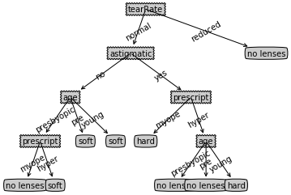

## 实验介绍

### 1.实验内容

本实验包括: 
* 学习并实现决策树算法----以ID3算法为例
* 基于决策树算法预测隐形眼镜类型

### 2.实验目标

通过本实验掌握决策树算法的基本原理。

### 3.实验知识点

* 香农熵
* 信息增益
* 决策树算法基本原理

### 4.实验环境

* python 3.6.5
* numpy 1.13.3
* matplotlib 2.2.3

### 实验准备

点击屏幕右上方的下载实验数据模块，选择下载decision_tree_glass.tgz到指定目录下，然后再依次选择点击上方的File->Open->Upload,上传刚才下载的数据集压缩包，再使用如下命令解压：


```python
!tar -zxvf decision_tree_glass.tgz
```

    decision_tree_glass/
    decision_tree_glass/lenses.txt
    decision_tree_glass/classifierStorage.txt


## 【海洋动物分类】

## 实验步骤：【海洋动物分类】- 概述

下表数据包含5个海洋动物，特征包括：不浮出水面是否可以生存，以及是否有脚蹼。我们将这些动物分成两类：鱼类和非鱼类。本实验要求基于决策树算法（ID3）实现对下表数据的分类。

id| 不浮出水面是否可以生存 | 是否有脚蹼 | 属于鱼类
:-: | :-: | :-:|:-:
1 | 是 | 是 | 是
2 | 是 | 是 | 是
3 | 是 | 否 | 否
4 | 否 | 是 | 否
5 | 否 | 是 | 否


```python
import math
import numpy as np
import matplotlib.pyplot as plt
import os
```

## 实验步骤：【海洋动物分类】- 创建数据集

基于上述表格，创建数据集。


```python
def createDataSet():
    """
    函数说明：创建数据集
    returns:
        dataSet - 数据集
        labels - 分类属性
    """
    dataSet = [[1, 1, 'yes'],
               [1, 1, 'yes'],
               [1, 0, 'no'],
               [0, 1, 'no'],
               [0, 1, 'no']]
    labels = ['no surfacing','flippers']
    return dataSet, labels
```

## 实验步骤：【海洋动物分类】- 计算香农熵


```python
def calcShannonEnt(dataSet):
    """
    函数说明:计算给定数据集的香农熵
    parameters:
        dataSet - 数据集
    returns:
        shannonEnt - 香农熵
    """
    totalNum = len(dataSet)
    labels = {}
    for vec in dataSet:
        Label = vec[-1]
        if Label not in labels.keys():
            labels[Label] = 0
        labels[Label] += 1
    shannonEnt = 0
    for Label in labels:
        a = float(labels[Label])/totalNum
        shannonEnt += (- a * np.math.log(a,2))
    return shannonEnt
```

## 实验步骤：【海洋动物分类】- 特征选择(基于信息增益划分数据集)

信息增益是相对于特征而言的，信息增益越大，特征对最终的分类结果影响也就越大，我们就应该选择对最终分类结果影响最大的那个特征作为我们的分类特征。

splitDataSet函数是用来选择各个特征的子集的。chooseBestFeatureToSplit函数是选择选择最优特征的函数。


```python
def splitDataSet(dataSet, axis, value):
    """
    函数说明: 按照给定特征划分数据集
    parameters:
        dataSet - 待划分的数据集
        axis - 划分数据集的特征 (第axis个特征)
        value - 特征值
    returns:
        retDataSet - 划分后的数据集
    """
    retDataSet = []
    for i in dataSet:
        if i[axis] == value:
            splitdata = i[:axis]+i[axis+1:]
            retDataSet.append(splitdata)
    return retDataSet


def chooseBestFeatureToSplit(dataSet):
    """
    函数说明: 选择最优特征
    parameters:
        dataSet - 数据集
    returns:
        bestFeature - 信息增益最大的(最优)特征的索引值
    """
    # 求第一行有多少列的 Feature, 最后一列是label列嘛
    numFeatures = len(dataSet[0]) - 1
    # label的信息熵
    baseEntropy = calcShannonEnt(dataSet)
    # 最优的信息增益值, 和最优的Featurn编号
    bestInfoGain, bestFeature = 0.0, -1
    for i in range(numFeatures):
        # create a list of all the examples of this feature
        # 获取每一个实例的第i+1个feature，组成list集合
        featList = [example[i] for example in dataSet]
        # get a set of unique values
        # 获取剔重后的集合，使用set对list数据进行去重
        uniqueVals = set(featList)
        # 创建一个临时的信息熵
        newEntropy = 0.0
        # 遍历某一列的value集合，计算该列的信息熵
        # 遍历当前特征中的所有唯一属性值，对每个唯一属性值划分一次数据集，计算数据集的新熵值，并对所有唯一特征值得到的熵求和
        for value in uniqueVals:
            subDataSet = splitDataSet(dataSet, i, value)
            prob = len(subDataSet)/float(len(dataSet))
            newEntropy += prob * calcShannonEnt(subDataSet)
        # gain[信息增益]: 划分数据集前后的信息变化， 获取信息熵最大的值
        # 信息增益是熵的减少或者是数据无序度的减少。最后，比较所有特征中的信息增益，返回最好特征划分的索引值。
        infoGain = baseEntropy - newEntropy
        # print('infoGain = ', 'bestFeature=', i, baseEntropy, newEntropy)
        if (infoGain > bestInfoGain):
            bestInfoGain = infoGain
            bestFeature = i
    return bestFeature


```

## 实验步骤：【海洋动物分类】- 构建决策树

决策树构建算法流程：得到原始数据集，基于最好的属性值划分数据集。第一次划分之后，数据将被向下传递到树分支的下一个节点，在这个节点上，再次划分数据。采用递归的原则处理数据集。

递归结束条件：程序遍历完所有划分数据集的属性，或者每个分支下的所有实例都具有相同的分类。


```python
def majorityCnt(classList):
    classificationCount = {}
    for i in classList:
        if not i in classificationCount.keys():
            classificationCount[i] = 0
        classificationCount[i] += 1
    sortedClassification = sorted(dict2list(classificationCount),key = operator.itemgetter(1),reverse = True)
    return sortedClassification[0][0]

def dict2list(dic:dict):
    keys = dic.keys()
    values = dic.values()
    lst = [(key,value)for key,value in zip(keys,values)]
    return lst

def createTree(dataSet, labels):
    """
    函数说明:创建决策树
    Parameters:
        dataSet - 训练数据集
        labels - 分类属性标签
    Returns:
        myTree - 决策树
    """
    classificationList = [feature[-1] for feature in dataSet] #产生数据集中的分类列表，保存的是每一行的分类
    if classificationList.count(classificationList[0]) == len(classificationList): #如果分类别表中的所有分类都是一样的，则直接返回当前的分类
        return classificationList[0]
    if len(dataSet[0]) == 1: #如果划分数据集已经到了无法继续划分的程度，即已经使用完了全部的feature，则进行决策
        return majority(classificationList)
    bestFeature = chooseBestFeatureToSplit(dataSet) #计算香农熵和信息增益来返回最佳的划分方案，bestFeature保存最佳的划分的feature的索引
    bestFeatureLabel = labels[bestFeature] #取出上述的bestfeature的具体值
    Tree = {bestFeatureLabel:{}}
    del(labels[bestFeature]) #删除当前进行划分是使用的feature避免下次继续使用到这个feature来划分
    featureValueList = [feature[bestFeature]for feature in dataSet] #对于上述取出的bestFeature,取出数据集中属于当前feature的列的所有的值
    uniqueValue = set(featureValueList) #去重
    for value in uniqueValue: #对于每一个feature标签的value值，进行递归构造决策树
        subLabels = labels[:]
        Tree[bestFeatureLabel][value] = createTree(splitDataSet(dataSet,bestFeature,value),subLabels)
    return Tree
```

## 实验步骤：【海洋动物分类】- 使用决策树进行分类


```python
def classify(inputTree, featLabels, testVec):
    """
    函数说明:使用决策树分类
    Parameters:
        inputTree - 已经生成的决策树
        featLabels - 存储选择的最优特征标签
        testVec - 测试数据列表，顺序对应最优特征标签
    Returns:
        classLabel - 分类结果
    """
   # 获取tree的根节点对于的key值
    firstStr = list(inputTree.keys())[0]
    # 通过key得到根节点对应的value
    secondDict = inputTree[firstStr]
    # 判断根节点名称获取根节点在label中的先后顺序，这样就知道输入的testVec怎么开始对照树来做分类
    featIndex = featLabels.index(firstStr)
    # 测试数据，找到根节点对应的label位置，也就知道从输入的数据的第几位来开始分类
    key = testVec[featIndex]
    valueOfFeat = secondDict[key]
    # 测试数据，找到根节点对应的label位置，也就知道从输入的数据的第几位来开始分类
    if isinstance(valueOfFeat, dict):
        classLabel=classify(valueOfFeat, featLabels, testVec)
    else:
        classLabel = valueOfFeat
    return classLabel
```


```python
if __name__ == '__main__':
    testVec1 = [1,0]
    testVec2 = [1,1]
    # 使用决策树对testVec1和testVec2分类
    myDat, labels = createDataSet()
    import copy
    myTree = createTree(myDat, copy.deepcopy(labels))
    print(myTree)
    # [1, 1]表示要取的分支上的节点位置，对应的结果值
    print(classify(myTree, labels, testVec1))
    print(classify(myTree, labels, testVec2))
    
```

    {'no surfacing': {0: 'no', 1: {'flippers': {0: 'no', 1: 'yes'}}}}
    no
    yes


## 【预测隐形眼镜类型】

## 实验步骤：【预测隐形眼镜类型】- 概述

本实验要求基于决策树算法，帮助人们判断需要佩戴的镜片类型。

### 数据介绍
隐形眼镜数据集是非常著名的数据集，它包含很多换着眼部状态的观察条件以及医生推荐的隐形眼镜类型。隐形眼镜类型包括硬材质(hard)、软材质(soft)以及不适合佩戴隐形眼镜(no lenses)。

数据集一共有24组数据，数据的Labels依次是age、prescript、astigmatic、tearRate、class，也就是第一列是年龄，第二列是症状，第三列是是否散光，第四列是眼泪数量，第五列是最终的分类标签。

## 实验步骤：【预测隐形眼镜类型】- 创建决策树

编写代码，基于隐形眼镜数据集构造决策树，并输出。


```python
decisionNode = dict(boxstyle="sawtooth", fc="0.8")
leafNode = dict(boxstyle="round4", fc="0.8")
arrow_args = dict(arrowstyle="<-")
 
def getNumLeafs(myTree):
    numLeafs = 0
    firstStr = list(myTree.keys())[0]
    secondDict = myTree[firstStr]
    # 根节点开始遍历
    for key in secondDict.keys():
        # 判断子节点是否为dict, 不是+1
        if type(secondDict[key]) is dict:
            numLeafs += getNumLeafs(secondDict[key])
        else:
            numLeafs += 1
    return numLeafs
 
def getTreeDepth(myTree):
    maxDepth = 0
    firstStr = list(myTree.keys())[0]
    secondDict = myTree[firstStr]
    # 根节点开始遍历
    for key in secondDict.keys():
        # 判断子节点是不是dict, 求分枝的深度
        if type(secondDict[key]) is dict:
            thisDepth = 1 + getTreeDepth(secondDict[key])
        else:
            thisDepth = 1
        # 记录最大的分支深度
        maxDepth = max(maxDepth, thisDepth)
    return maxDepth
 
def plotNode(nodeTxt, centerPt, parentPt, nodeType):
    createPlot.ax1.annotate(nodeTxt, xy=parentPt, xycoords='axes fraction', xytext=centerPt, textcoords='axes fraction',va="center", ha="center", bbox=nodeType, arrowprops=arrow_args)
 

```


```python
def plotMidText(cntrPt, parentPt, txtString):
    xMid = (parentPt[0] - cntrPt[0]) / 2 + cntrPt[0]
    yMid = (parentPt[1] - cntrPt[1]) / 2 + cntrPt[1]
    createPlot.ax1.text(xMid, yMid, txtString, va="center", ha="center", rotation=30)
    
def plotTree(myTree, parentPt, nodeTxt):
    # 获取叶子节点的数量
    numLeafs = getNumLeafs(myTree)
    # 获取树的深度
    # depth = getTreeDepth(myTree)
 
    # 找出第1个中心点的位置，然后与 parentPt定点进行划线
    cntrPt = (plotTree.xOff + (1 + numLeafs) / 2 / plotTree.totalW, plotTree.yOff)
    # print(cntrPt)
    # 并打印输入对应的文字
    plotMidText(cntrPt, parentPt, nodeTxt)
 
    firstStr = list(myTree.keys())[0]
    # 可视化Node分支点
    plotNode(firstStr, cntrPt, parentPt, decisionNode)
    # 根节点的值
    secondDict = myTree[firstStr]
    # y值 = 最高点-层数的高度[第二个节点位置]
    plotTree.yOff = plotTree.yOff - 1 / plotTree.totalD
    for key in secondDict.keys():
        # 判断该节点是否是Node节点
        if type(secondDict[key]) is dict:
            # 如果是就递归调用[recursion]
            plotTree(secondDict[key], cntrPt, str(key))
        else:
            # 如果不是，就在原来节点一半的地方找到节点的坐标
            plotTree.xOff = plotTree.xOff + 1 / plotTree.totalW
            # 可视化该节点位置
            plotNode(secondDict[key], (plotTree.xOff, plotTree.yOff), cntrPt, leafNode)
            # 并打印输入对应的文字
            plotMidText((plotTree.xOff, plotTree.yOff), cntrPt, str(key))
    plotTree.yOff = plotTree.yOff + 1 / plotTree.totalD

def createPlot(inTree):
    # 创建一个figure的模版
    fig = plt.figure(1)
    fig.clf()
 
    axprops = dict(xticks=[], yticks=[])
    # 表示创建一个1行，1列的图，createPlot.ax1 为第 1 个子图，
    createPlot.ax1 = plt.subplot(111, frameon=False, **axprops)
 
    plotTree.totalW = float(getNumLeafs(inTree))
    plotTree.totalD = float(getTreeDepth(inTree))
    # 半个节点的长度
    plotTree.xOff = -0.5 / plotTree.totalW
    plotTree.yOff = 1.0
    plotTree(inTree, (0.5, 1.0), '')
    plt.show()
```


```python
# 加载隐形眼镜相关的 文本文件 数据
    fr = open('decision_tree_glass/lenses.txt','r',encoding='utf-8')
    # 解析数据，获得 features 数据
    lenses = [inst.strip().split('\t') for inst in fr.readlines()]
    # 得到数据的对应的 Labels
    lensesLabels = ['age', 'prescript', 'astigmatic', 'tearRate']
    # 使用上面的创建决策树的代码，构造预测隐形眼镜的决策树
    lensesTree = createTree(lenses, lensesLabels)
    print(lensesTree)
    # 画图可视化展现
    createPlot(lensesTree)
```

    {'tearRate': {'normal': {'astigmatic': {'no': {'age': {'presbyopic': {'prescript': {'myope': 'no lenses', 'hyper': 'soft'}}, 'pre': 'soft', 'young': 'soft'}}, 'yes': {'prescript': {'myope': 'hard', 'hyper': {'age': {'presbyopic': 'no lenses', 'pre': 'no lenses', 'young': 'hard'}}}}}}, 'reduced': 'no lenses'}}




