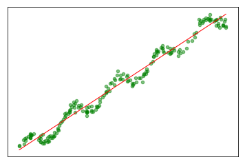

## 实验介绍

### 1.实验内容

本实验介绍线性回归算法,并通过小实验简单认识一下线性回归算法 。

实验1：用线性回归找到最佳拟合直线

实验2：局部加权线性回归找到最佳拟合直线

实验3：使用scikit-learn实现线性回归算法

### 2.实验目标

通过本实验掌握线性回归算法找到最佳拟合直线的方法。

### 3.实验知识点

* 线性回归

### 4.实验环境

* python 3.6.5  

### 5.预备知识

* 概率论与数理统计
* Linux命令基本操作
* Python编程基础

## 准备工作

点击屏幕右上方的下载实验数据模块，选择下载multiple_linear_regression.tgz到指定目录下，然后再依次选择点击上方的File->Open->Upload,上传刚才下载的数据集压缩包，再使用如下命令解压：


```python
!tar -zxvf multiple_linear_regression.tgz
```

    multiple_linear_regression/
    multiple_linear_regression/ex0.txt


## 【实验】用线性回归找到最佳拟合直线 

接下来，我们使用普通最小二乘法线性回归来依据给定数据找到最佳拟合直线。
### 1.数据样例
数据样例为数据集目录下的ex0.txt文件，我们先来看下我们的数据及其分布：


```shell
cat multiple_linear_regression/ex0.txt
```

```shell
1.000000	0.067732	3.176513
1.000000	0.427810	3.816464
1.000000	0.995731	4.550095
1.000000	0.738336	4.256571
1.000000	0.981083	4.560815
1.000000	0.526171	3.929515
1.000000	0.378887	3.526170
1.000000	0.033859	3.156393
1.000000	0.132791	3.110301
1.000000	0.138306	3.149813
1.000000	0.247809	3.476346
1.000000	0.648270	4.119688
```


其中第一个值总是等于1.0，即x0。我们假定偏移量就是一个常数，第二个值X1，也就是横坐标值，最后一列为Y值，即目标值。

### 2.数据加载及可视化


```python
import matplotlib.pyplot as plt
import numpy as np

def loadDataSet(fileName):

    """
    函数说明:加载数据
    Parameters:
        fileName - 文件名
    Returns:
        xArr - x数据集
        yArr - y数据集
    """
    num = len(open(fileName).readline().split('\t'))-1
    xArr = []
    yArr = []
    data = open(fileName)
    for lines in data.readlines():
        lineData = []
        tmp = lines.strip().split('\t')
        for i in range (num):
            lineData.append(float(tmp[i]))
        xArr.append(lineData)
        yArr.append(float(tmp[-1]))
    return np.array(xArr), np.array(yArr)

def plotDataSet():
    """
    函数说明:绘制数据集
    Parameters:
        无
    Returns:
        无
    """
    x, y = loadDataSet('./multiple_linear_regression/ex0.txt')
    #print(x)
    plt.scatter(x[:, 1], y)
    plt.show()

if __name__ == '__main__':
    plotDataSet()
```


### 3.代码实现


```python
from numpy import *
import matplotlib.pyplot as plt

def standRegres(xArr,yArr):
    """
    计算最佳拟合直线
    parameters:
        xArr -给定的输入值
        yArr -给定的输出值
    return:
        ws -回归系数
    """
    A = xArr[:, (1,0)]
    # print(A)
    b = yArr
    B = A.T.dot(b)
    AA = np.linalg.inv(A.T.dot(A)) #求A.T.dot(A)的逆
    P = AA.dot(B)
    return P
    
def showLinerRegre():
    """
    绘制最佳拟合直线
    parameters:
        null
    return:
        null
    """
    xArr ,yArr = loadDataSet('multiple_linear_regression/ex0.txt') #加载数据集
    ws = standRegres(xArr, yArr)         #得到回归系数
    print(ws)
    plt.scatter(xArr[:, 1], yArr)
    x = np.linspace(min(xArr[:,1]), max(xArr[:,1]), 200)
    y = ws[0] * x + ws[1]
    plt.plot(x, y, c='r', alpha=0.5)
    plt.show()
    
if __name__ =='__main__':
    showLinerRegre()
```

    [ 1.69532264  3.00774324]


几乎任一数据集都可以用上述方法建立模型，那么，如何判断这些模型的好坏呢？

显然我们看到有些数据是没有正确的拟合的，这被称为欠拟合。最佳拟合直线将数据视为直线进行建模，具有十分不错的表现。

但图中的数据似乎还存在其他的潜在模式，下一节我们介绍如何根据数据来局部调整预测。

## 【实验】局部加权线性回归找到最佳拟合直线 
### 1.局部线性回归
线性回归的一个问题是有可能出现欠拟合现象，因为它求的是具有小均方误差的无偏估 计。显而易见，如果模型欠拟合将不能取得好的预测效果。所以有些方法允许在估计中引入一 些偏差，从而降低预测的均方误差。

其中的一个方法是局部加权线性回归（Locally Weighted Linear Regression，LWLR）。在该方法中，我们给待预测点附近的每个点赋予一定的权重。与kNN一样，这种算法每次预测均需要事先选取出对应的数据子集。该算法解出回归系数W的形式如下：

$$
w=(X^TWX)^{-1}X^TWY
$$

其中W是一个矩阵，这个公式跟我们上面推导的公式的区别就在于W，它用来给每个点赋予权重。

LWLR使用"核"（与支持向量机中的核类似）来对附近的点赋予更高的权重。核的类型可以自由选择，最常用的核就是高斯核，高斯核对应的权重如下：

$$
w(i)=exp(-\frac{(x^{(i)}-x)^2}{2k^2})
$$
这样我们就可以根据上述公式，编写局部加权线性回归，我们通过改变k的值，可以调节回归效果

### 2.代码实现

在当前工作目录下新建文件partialLinerRegre.py，添加如下代码：


```python

def lwlr(testPoint, xArr, yArr, k=1.0):
    """
    计算回归系数
    parameters:
        testPoint -待预测数据
        xArr -给定输入值
        yArr -给定输出值
        k -高斯核的k值，决定对附近的点赋予多大的权重
    return:
        testPoint * ws -回归系数的估计值
    """
    xMat = mat(xArr)
    yMat = mat(yArr).T
    m = shape(xMat)[0]
    weights = mat(eye((m)))    # 权值矩阵，初始化为单位阵（最后得到的W是对角阵）
    for j in range(m):        # 计算对应点权值
        diffMat = testPoint - xMat[j,:]    # 计算x_i - x
        weights[j,j] = exp(diffMat * diffMat.T/(-2.0*k**2)) # 计算高斯核权重函数
    xTx = xMat.T * (weights * xMat)   # 计算X^TWX
    if linalg.det(xTx) == 0.0:
        print("Error")
        return
    ws = xTx.I * (xMat.T * (weights * yMat))   # 计算(X^TWX)^{-1}X^TWY
    return testPoint*ws


def lwlrTest(testArr, xArr, yArr,k=1.0):
    """
    测试函数
    parameters:
        testArr -测试数据集
        xArr -给定输入值
        yArr -给定输出值
        k -高斯核的k值
    return:
        yHat -预测值
    """
    m = shape(testArr)[0]
    yHat = zeros(m)
    for i in range(m):
        yHat[i] = lwlr(testArr[i], xArr, yArr, k)
    return yHat


def plotlwlrRegression():
    """
    绘制多条局部加权回归曲线
    parameters:
            无
    returns:
            无
     """
    xArr, yArr = loadDataSet('multiple_linear_regression/ex0.txt')      #加载数据集
    yHat_1 = lwlrTest(xArr, xArr, yArr, 1.0)                            #根据局部加权线性回归计算yHat
    yHat_2 = lwlrTest(xArr, xArr, yArr, 0.01)                            #根据局部加权线性回归计算yHat
    yHat_3 = lwlrTest(xArr, xArr, yArr, 0.003)                            #根据局部加权线性回归计算yHat
    xMat = mat(xArr)                                                    #创建xMat矩阵
    yMat = mat(yArr)                                                    #创建yMat矩阵
    srtInd = xMat[:, 1].argsort(0)                                        #排序，返回索引值
    xSort = xMat[srtInd][:,0,:]
    fig, axs = plt.subplots(nrows=3, ncols=1,sharex=False, sharey=False, figsize=(10,8))                                        
    axs[0].plot(xSort[:, 1], yHat_1[srtInd], c = 'red')                        #绘制回归曲线
    axs[1].plot(xSort[:, 1], yHat_2[srtInd], c = 'red')                        #绘制回归曲线
    axs[2].plot(xSort[:, 1], yHat_3[srtInd], c = 'red')                        #绘制回归曲线
    axs[0].scatter(xMat[:,1].flatten().A[0], yMat.flatten().A[0], s = 20, c = 'green', alpha = .5)                #绘制样本点
    axs[1].scatter(xMat[:,1].flatten().A[0], yMat.flatten().A[0], s = 20, c = 'green', alpha = .5)                #绘制样本点
    axs[2].scatter(xMat[:,1].flatten().A[0], yMat.flatten().A[0], s = 20, c = 'green', alpha = .5)                #绘制样本点
    #设置标题,x轴label,y轴label
    axs0_title_text = axs[0].set_title(u'lwlr,k=1.0')
    axs1_title_text = axs[1].set_title(u'lwlr,k=0.01')
    axs2_title_text = axs[2].set_title(u'lwlr,k=0.003')
    plt.setp(axs0_title_text, size=8, weight='bold', color='red')  
    plt.setp(axs1_title_text, size=8, weight='bold', color='red')  
    plt.setp(axs2_title_text, size=8, weight='bold', color='red')  
    plt.xlabel('X')
    plt.show()

if __name__ == '__main__':
    plotlwlrRegression()
```


可以看到，当k越小，拟合效果越好。但是当k过小，会出现过拟合的情况，例如k等于0.003的时候

在算法实现的过程中，我们可以体会到局部加权线性回归也存在一个问题，它对每个点做预测时都必须使用整个数据集，大大的增加了计算量。

##  【实验】使用scikit-learn实现线性回归算法

sklearn.linear_model模块提供了很多集成操作，线性回归、岭回归、贝叶斯回归等。本文使用的是LinearRegression。

让我们先看下LinearRegression这个函数，一共有4个参数：
参数说明如下：

    fit_intercept：可选参数，布尔值，默认为True。是否对数据进行中心化。如果该变量为false，则表明数据已经进行了中心化，在下面的过程中不进行中心化处理，否则对输入数据进行中心化处理。
    
    normalize：可选参数，布尔值，默认为False。是否对数据进行标准化处理。当fit_intercept设置为false时，该参数会被忽略。如果该变量为true，则对数据进行标准化处理。需要在使用normalize=False的estimator调用fit之前使用sklearn.preprocessing.StandardScaler。
    
    copy_X:可选参数，布尔值，默认为True。该值为true，复制X；否则，重写X。
    
    n_jobs:可选参数，整型，默认为1。计算时设置的任务个数(number of jobs)。如果选择-1则代表使用所有的CPU。这一参数的对于目标个数>1（n_targets>1）且足够大规模的问题有加速作用。

返回值：

    coef_ :数组型变量，shape为（n_feature）或者(n_targets,n_features)。线性回归问题中的回归系数。如果输入为多目标问题，即fit二维数据，则返回一个二维数组，shape为（n_targets,n_features）；如果输入为单目标问题，返回一个一维数组。
    
    intercept_：数组型变量。线性模型中的独立项。


方法：

    decision_function(X)  对训练数据X进行预测
    
    fit(X, y[, n_jobs])                     对训练集X, y进行训练。是对scipy.linalg.lstsq的封装
    
    get_params([deep]) 得到该估计器(estimator)的参数。
    
    predict(X) 使用训练得到的估计器对输入为X的集合进行预测（X可以是测试集，也可以是需要预测的数据）。
    
    score(X, y[,]sample_weight)   返回对于以X为samples，以y为target的预测效果评分。
    
    set_params(**params)            设置估计器的参数


了解了这些，接下来，我们使用sklearn库来实现我们第一个实验中的线性回归模型。添加如下代码：


```python
#!/usr/bin/env python
#-*- coding:utf-8 -*-
import matplotlib.pyplot as plt
from numpy import *
from sklearn import datasets, linear_model
from sklearn.metrics import mean_squared_error, r2_score


def loadDataSet(fileName):      
    """
    打开一个用tab键分隔的文本文件
    parameters:
        fileName -文件名
    return:
        dataMat -数据矩阵
        labelMat -目标值向量
    """
    data = loadtxt(fileName, delimiter='\t')
    dataMat = array(data[:, 1])
    labelMat = array(data[:, 2])
    return dataMat,labelMat

if __name__ =='__main__':
    dataX, dataY =loadDataSet('multiple_linear_regression/ex0.txt')
    matX=mat(dataX).T;matY=mat(dataY).T #将数据保存到矩阵中
    regr = linear_model.LinearRegression() #生成线性回归模型
    #填充训练数据 matX(n_samples,n_features);matY(n_samples,n_targets)
    regr.fit(matX, matY)
    print(regr.intercept_, regr.coef_)
    xCopy = matX.copy()
    xCopy.sort(0)
    predictY = regr.predict(xCopy) #得到模型预测值

    plt.scatter(matX[:,0].flatten().A[0],matY[:,0].flatten().A[0],s=20,color='green',alpha=.5) #绘制散点图
    plt.plot(xCopy[:,0],predictY,color='red',linewidth=1) #绘制最佳拟合直线
 
    plt.xticks(())
    plt.yticks(())

    plt.show()
```

    [ 3.00774324] [[ 1.69532264]]





## 实验总结

### 1. 掌握内容
本节我们介绍了找出最佳拟合直线的两种方法，您应该能达到以下两个目标：

1. 实现最小二乘法线性回归算法。

2. 实现局部加权线性回归算法。

## 参考文献与延伸阅读

### 参考资料:

1.哈林顿，李锐. 机器学习实战 : Machine learning in action[M]. 人民邮电出版社, 2013.  
2.周志华. 机器学习:Machine learning[M]. 清华大学出版社, 2016.

### 延伸阅读

1.李航. 统计学习方法[M]. 清华大学出版社, 2012.
