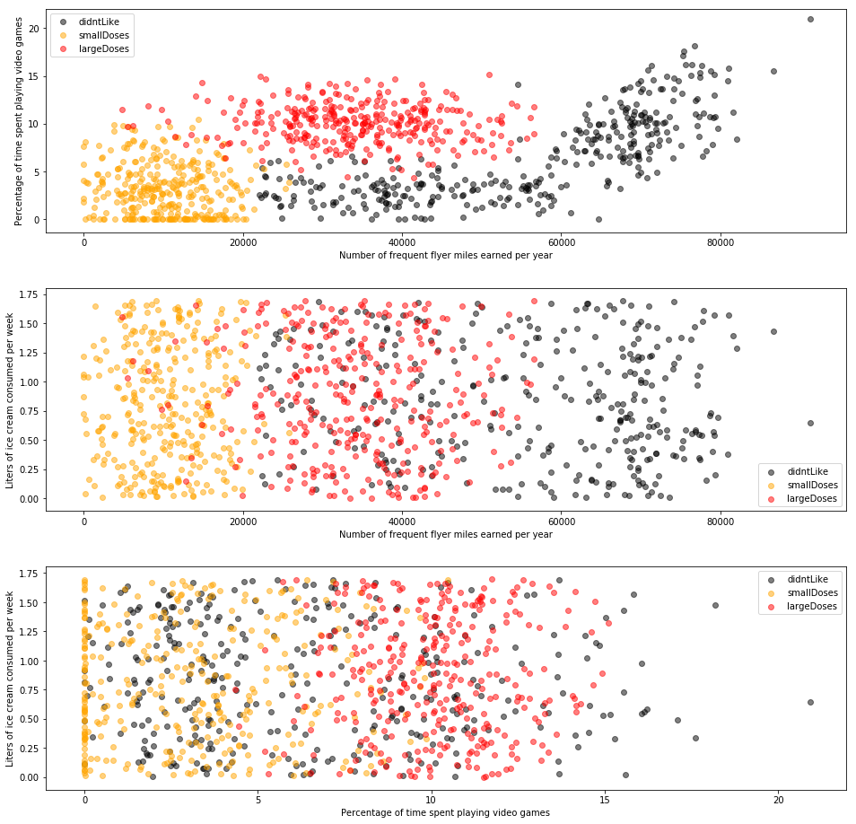

## 实验介绍

### 1.实验内容

本实验包括: 
* 熟悉课程平台Jupyter实验环境
* 使用Matplotlib创建散点图

### 2.实验目标

通过实验熟悉课程平台环境，掌握Jupyter的基础操作

### 3.实验环境

* python 3.6.5
* numpy 1.13.3
* matplotlib 2.2.3

### 实验准备

点击屏幕右上方的下载实验数据模块，选择下载kNN_Dating.tgz到指定目录下，然后再依次选择点击上方的File->Open->Upload,上传刚才下载的数据集压缩包，再使用如下命令解压：


```shell
!tar -zxvf kNN_Dating.tgz
```

```shell
kNN_Dating/
kNN_Dating/datingTestSet.txt
```

```python
import numpy as np
import matplotlib.lines as mlines
import matplotlib.pyplot as plt
```

## 【绘制散点图】

## 实验步骤：【绘制散点图】- 概述

### 数据介绍
海伦收集约会数据已经有了一段时间，她把这些数据存放在文本文件datingTestSet.txt中，每个样本数据占据一行，总共有1000行。

海伦收集的样本数据主要包含以下3种特征：
* 每年获得的飞行常客里程数 (Number of frequent flyer miles earned per year)
* 玩视频游戏所消耗时间百分比 (Percentage of time spent playing video games)
* 每周消费的冰淇淋公升数 (Liters of ice cream consumed per week)

数据标签包含以下3类：
* 不喜欢的人 (didntLike)
* 魅力一般的人 (smallDoses)
* 极具魅力的人 (largeDoses)

## 实验步骤：【绘制散点图】- 数据读取与处理

将数据分类两部分，即特征矩阵和对应的分类标签向量。定义名为file2matrix的函数，以此来处理输入格式问题。编写代码如下：


```python
def file2matrix(filename):
    """
    函数说明：加载数据集
    parameters:
        fileName - 文件名
    return:
        featureMat - 特征矩阵
        classLabelVector - 类别标签向量(didntLike - 0, smallDoses - 1, largeDoses - 2)
    """
    dict = {'didntLike': 0, 'smallDoses': 1, 'largeDoses': 2}		# 将标签存入字典方便后续处理
    a = np.loadtxt(filename, delimiter='\t', dtype='str')			# 通过numpy的loadtxt以制表符为分界读取数据
    featureMat = []
    classLabelVector = []
    for rows in a:
        rtmp = []
        for col in rows[0:-1]:
            rtmp.append(float(col))
        featureMat.append(rtmp)
        classLabelVector.append(dict[rows[-1]])						# 最后一列为标签，化为整形存储
    return featureMat, classLabelVector
    
```

## 实验步骤：【绘制散点图】- 分析数据数据可视化 


```python
def showdatas(datingDataMat, datingLabels):
    """
    函数说明：绘制散点图
    parameters:
        datingDataMat - 特征矩阵
        datingLabels - 类别标签向量(didntLike - 0, smallDoses - 1, largeDoses - 2)
    """
    mask = [datingLabels[i] == 0 for i in range(len(datingLabels))]		# 筛选符合预期标签的行集合
    tmp0 = []
    for i in range(len(datingLabels)):
        if mask[i]:
            tmp0.append(datingDataMat[i])
    tmp0 = np.array(tmp0)												# 转化为numpy数组

    mask = [datingLabels[i] == 1 for i in range(len(datingLabels))]
    tmp1 = []
    for i in range(len(datingLabels)):
        if mask[i]:
            tmp1.append(datingDataMat[i])
    tmp1 = np.array(tmp1)

    mask = [datingLabels[i] == 2 for i in range(len(datingLabels))]
    tmp2 = []
    for i in range(len(datingLabels)):
        if mask[i]:
            tmp2.append(datingDataMat[i])
    tmp2 = np.array(tmp2)

    plt.figure(figsize=(16, 16))
    plt.title("")
    
    plt.subplot(3, 1, 1)												# 绘制子图
    plt.scatter(tmp0[:, 0], tmp0[:, 1], color='black', marker='o', alpha=0.5, label='didntLike')
    plt.scatter(tmp1[:, 0], tmp1[:, 1], color='orange', marker='o', alpha=0.5, label='smallDoses')
    plt.scatter(tmp2[:, 0], tmp2[:, 1], color='red', marker='o', alpha=0.5, label='largeDoses')
    plt.xlabel("Number of frequent flyer miles earned per year")
    plt.ylabel("Percentage of time spent playing video games")
    plt.legend(loc='upper left')

    plt.subplot(3, 1, 2)
    plt.scatter(tmp0[:, 0], tmp0[:, 2], color='black', marker='o', alpha=0.5, label='didntLike')
    plt.scatter(tmp1[:, 0], tmp1[:, 2], color='orange', marker='o', alpha=0.5, label='smallDoses')
    plt.scatter(tmp2[:, 0], tmp2[:, 2], color='red', marker='o', alpha=0.5, label='largeDoses')
    plt.xlabel("Number of frequent flyer miles earned per year")
    plt.ylabel("Liters of ice cream consumed per week")
    plt.legend(loc='lower right')

    plt.subplot(3, 1, 3)
    plt.scatter(tmp0[:, 1], tmp0[:, 2], color='black', marker='o', alpha=0.5, label='didntLike')
    plt.scatter(tmp1[:, 1], tmp1[:, 2], color='orange', marker='o', alpha=0.5, label='smallDoses')
    plt.scatter(tmp2[:, 1], tmp2[:, 2], color='red', marker='o', alpha=0.5, label='largeDoses')
    plt.xlabel("Percentage of time spent playing video games")
    plt.ylabel("Liters of ice cream consumed per week")
    plt.legend(loc='upper right')

    plt.subplots_adjust(left=None, bottom=None, right=None, top=None, wspace=0, hspace=0.25)	# 调整间距避免y轴标签重叠

    plt.show()
```


```python
if __name__ == '__main__':
    filename = "kNN_Dating/datingTestSet.txt"
    datingDataMat, datingLabels = file2matrix(filename)
    showdatas(datingDataMat, datingLabels)
```




